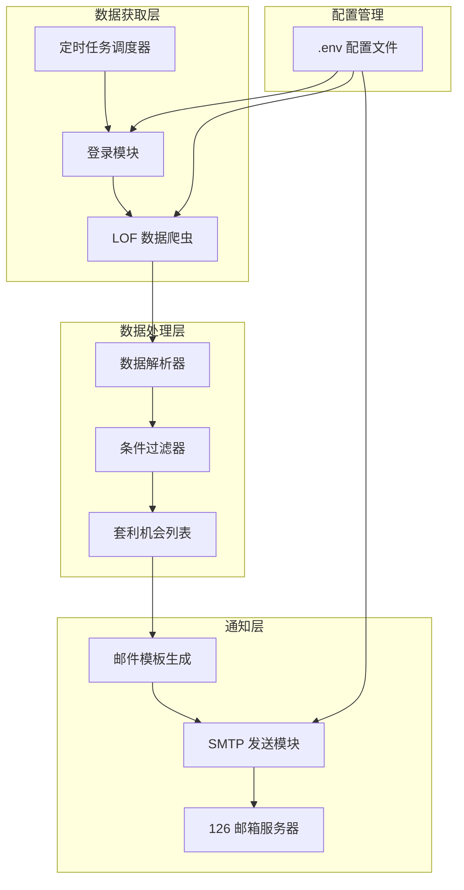
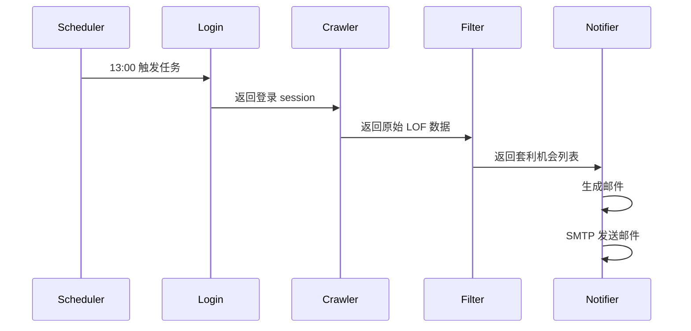

# LOF 套利监控器 - 技术方案

## 项目概述

从集思录 (jisilu.cn) 网站获取 LOF 套利数据，每天 13:00 自动发送提醒邮件到指定邮箱。

## 系统架构



## 目录结构

```
LOFHacker/
├── .env                    # 环境变量配置 (不提交到版本控制)
├── .env.example            # 配置模板
├── requirements.txt        # Python 依赖
├── main.py                 # 主入口
├── config/
│   └── settings.py         # 配置加载模块
├── scraper/
│   ├── __init__.py
│   ├── jisilu.py           # 集思录爬虫
│   └── login.py            # 登录模块
├── filter/
│   └── arbitrage_filter.py # 套利条件过滤
├── notifier/
│   └── email_notifier.py   # 邮件通知模块
├── scheduler/
│   └── daily_job.py        # 定时任务调度
└── logs/
    └── app.log             # 运行日志
```

## 核心模块设计

### 1. 配置管理 (config/settings.py)

使用 `python-dotenv` 加载 `.env` 文件中的环境变量：

```python
# .env 文件内容
JISILU_USERNAME=your_username
JISILU_PASSWORD=your_password
EMAIL_SMTP_SERVER=smtp.126.com
EMAIL_SMTP_PORT=465
EMAIL_USERNAME=your_email@126.com
EMAIL_PASSWORD=your_email_auth_code
EMAIL_RECIPIENT=recipient@example.com
PREMIUM_THRESHOLD=0.5
```

### 2. 登录模块 (scraper/login.py)

使用 `requests.Session` 维持登录状态：

- POST 登录到 `https://www.jisilu.cn/account/ajax/login_process/`
- 保存 cookies 用于后续请求
- 处理登录失败和 session 过期

### 3. 数据爬虫 (scraper/jisilu.py)

获取 LOF 套利数据：

- URL: `https://www.jisilu.cn/data/lof/arbitrage/`
- 使用登录后的 session 发送 GET 请求
- 解析 HTML 表格或使用网站 API (如果有)
- 返回结构化数据列表

### 4. 过滤器 (filter/arbitrage_filter.py)

筛选套利机会：

- 条件 1: 申购状态 == "限额"
- 条件 2: 溢价率 > 0.5%
- 返回符合条件的 LOF 列表

### 5. 邮件通知 (notifier/email_notifier.py)

使用 `smtplib` 发送邮件：

- 连接 126 SMTP 服务器 (SSL)
- 生成 HTML 格式邮件内容
- 包含：代码、名称、溢价率、申购状态

### 6. 定时任务 (scheduler/daily_job.py)

使用 `schedule` 或 `APScheduler` 库：

- 每天 13:00 (Asia/Shanghai 时区) 执行
- 调用完整流程：登录 → 抓取 → 过滤 → 发送邮件

## 数据流程



## 依赖库

```
requests>=2.31.0        # HTTP 请求
beautifulsoup4>=4.12.0  # HTML 解析
python-dotenv>=1.0.0    # 环境变量
schedule>=1.2.0         # 定时任务
pytz>=2023.3            # 时区处理
```

## 部署方案 (阿里云服务器)

### 1. 环境准备

```bash
# 安装 Python 3.8+
python3 --version

# 创建虚拟环境
python3 -m venv .venv
source .venv/bin/activate

# 安装依赖
pip install -r requirements.txt
```

### 2. 配置环境变量

```bash
cp .env.example .env
# 编辑 .env 填入实际配置
```

### 3. 设置定时任务

使用 crontab 或 systemd：

```bash
# crontab 方式 - 每天 13:00 执行
0 13 * * * cd /path/to/LOFHacker && /path/to/.venv/bin/python main.py >> logs/cron.log 2>&1
```

### 4. 日志监控

```bash
tail -f logs/app.log
```

## 邮件模板示例

```html
<html>
<body>
<h2>LOF 套利机会提醒</h2>
<p>发送时间：2024-03-07 13:00:00</p>
<table border="1">
<tr><th>代码</th><th>名称</th><th>溢价率</th><th>申购状态</th></tr>
<tr><td>160xxx</td><td>某某 LOF</td><td>1.25%</td><td>限额</td></tr>
</table>
<p>共发现 X 个套利机会</p>
</body>
</html>
```

## 异常处理

1. **登录失败**: 记录日志，发送邮件通知管理员
2. **网络错误**: 重试 3 次，失败后记录日志
3. **数据解析错误**: 记录原始 HTML 到日志
4. **邮件发送失败**: 记录错误，不中断主流程

## 安全考虑

1. `.env` 文件加入 `.gitignore`
2. 邮箱使用授权码而非登录密码
3. 服务器设置防火墙规则
4. 定期更新依赖库

## 下一步行动

1. 切换到 Code 模式实现各模块
2. 测试登录和数据抓取
3. 配置邮件发送
4. 部署到阿里云服务器
